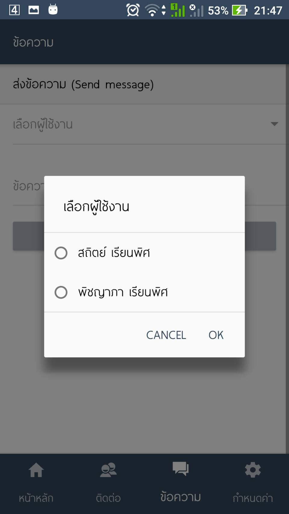
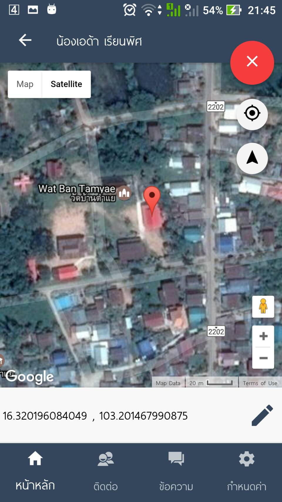
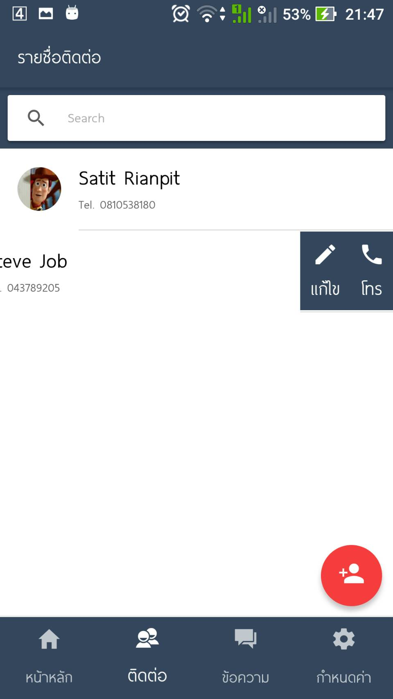

สำหรับใช้อบรม Ionic framework

อนุญาตให้นำไปศึกษาหรือพัฒนาต่อยอดได้ แต่ห้ามจำหน่าย/วิจัย/โปรเจคจบ (คงไม่ว่ากันนะครับ 55++)

วันอบรมจะมีคู่มือประกอบการอบรมให้เพิ่มเติม

# Installation

- ดาวน์โหลด .zip หรือจะ clone ก็ได้ครับ จะได้โฟลเดอร์ src, resources 
- สร้าง project ionic ใหม่ `ionic start MyApp blank --v2 --ts`
- copy โฟลเดอร์ src, resources แทนที่โฟลเดอร์เดิม
- เสร็จแล้วรัน app ได้ครับ
- ต้องติดตั้ง rest-server ด้วยนะครับ เสร็จแล้ว แก้ไข ไฟล์​ `app/app.modules.ts` บรรทัดที่ 61  ดังนี้ `{ provide: 'API_URL', useValue: 'http://192.168.200.21:3000' },` โดยให้เปลี่ยน url ใหม่เป็น IP ของเครื่อง server แทน

# Plugins

```
cordova-plugin-actionsheet 2.3.1 "ActionSheet"
cordova-plugin-camera 2.3.0 "Camera"
cordova-plugin-compat 1.1.0 "Compat"
cordova-plugin-console 1.0.4 "Console"
cordova-plugin-device 1.1.3 "Device"
cordova-plugin-geolocation 2.4.0 "Geolocation"
cordova-plugin-splashscreen 4.0.0 "Splashscreen"
cordova-plugin-statusbar 2.2.0 "StatusBar"
cordova-plugin-whitelist 1.3.0 "Whitelist"
cordova-sqlite-storage 2.0.0 "Cordova sqlite storage plugin"
ionic-plugin-keyboard 2.2.1 "Keyboard"
mx.ferreyra.callnumber 0.0.2 "Cordova Call Number Plugin"
phonegap-plugin-push 1.8.4 "PushPlugin"
uk.co.workingedge.phonegap.plugin.launchnavigator 3.2.1 "Launch Navigator"
```

# Screen Short







